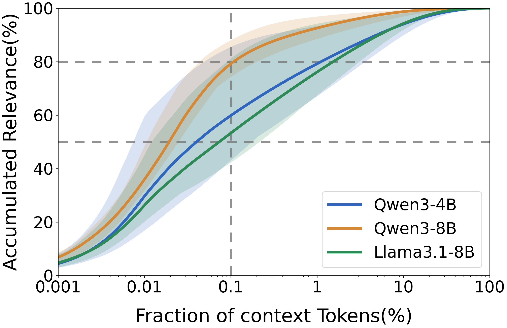
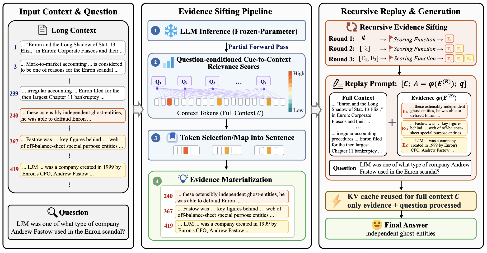
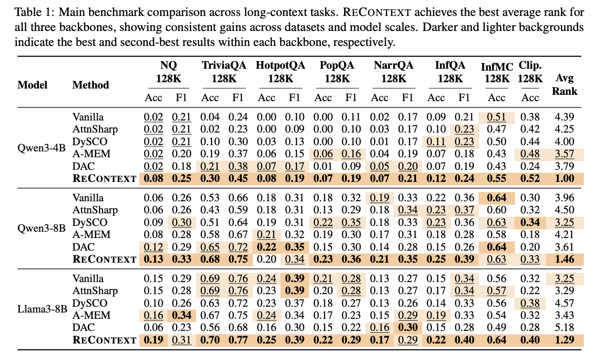

# ReContext

**ReContext: Recursive Evidence Replay as an LLM Harness for Long-Context Reasoning**

## Motivation

The core challenge of Long-context reasoning is not only fitting the context into the model, but also helping the model repeatedly focus on the small evidence set that matters at generation time.

The below figure shows: **in 128K-token contexts, the top 0.1% of question-relevant tokens already account for roughly 50% to 80% of the accumulated relevance score across different LLMs**. This concentration suggests that long-context reasoning can be improved by making the model's own sparse relevance structure explicit: rather than compressing or discarding the context, ReContext surfaces the tokens that the model already treats as important and reintroduces their surrounding spans as grounded evidence.


<p align="center">
  
</p>


## Method

<p align="center">
  
</p>

As illustrated above, ReContext separates evidence organization from answer generation:

1. **Attention readout.** The model performs a read pass over the original long prompt. ReContext aggregates attention from query-side cue tokens over selected retrieval heads to score context tokens.
2. **Evidence materialization.** Top-scoring context tokens are mapped back to their containing sentences or local spans. The evidence pool is copied from the original prompt, not generated by another model.
3. **Recursive replay.** Across a small fixed number of rounds, ReContext inserts the accumulated evidence pool near the question and re-scores the context under this replay-conditioned prompt.
4. **Final generation.** The model generates from the full original context plus the replayed evidence pool. Unselected context remains available, so replay emphasizes evidence without pruning the input.

## Main Results

<p align="center">
  
</p>

`exp.png` summarizes the main 128K-token benchmark across eight long-context tasks and three backbones.  ReContext achieves the best average rank for Qwen3-4B, Qwen3-8B, and Llama3-8B, with consistent gains across QA, multi-choice, narrative, and synthetic long-context settings. The results indicate that recursive evidence replay is useful across both smaller and larger backbones without retraining the model.

## Setup

Create the conda environment and install FlashAttention:

```bash
conda env create -f env.yml
conda activate recontext
python -m pip install flash_attn==2.8.3
```

If the source install fails on your CUDA/PyTorch stack, install a matching wheel from the FlashAttention release page, for example:

```bash
wget -O flash_attn-2.8.3+cu12torch2.6cxx11abiTRUE-cp310-cp310-linux_x86_64.whl \
  "https://github.com/Dao-AILab/flash-attention/releases/download/v2.8.3/flash_attn-2.8.3+cu12torch2.6cxx11abiTRUE-cp310-cp310-linux_x86_64.whl"
python -m pip install ./flash_attn-2.8.3+cu12torch2.6cxx11abiTRUE-cp310-cp310-linux_x86_64.whl
```

## Data

The reproduction scripts expect evaluation data under `data_eval/`, which can be downloaded from [Google Drive](https://drive.google.com/file/d/17Fyre8lgietQdu4UUtwEk5nCceInd_8w/view?usp=sharing).

```text
data_eval/
  clipper/test-100.json
  infbench/infbench_choice_eng_130862_100.json
  infbench/infbench_qa_eng_130862_100.json
  kilt/hotpotqa-dev-multikilt_100_k1000_dep3.json
  kilt/nq-dev-multikilt_100_k1000_dep6.json
  kilt/popqa_test_100_k1000_dep6.json
  kilt/triviaqa-dev-multikilt_100_k1000_dep6.json
  narrativeqa/narrativeqa_130772_100.json
```

`run_eval.py` maps the public dataset names used by the scripts, such as `kilt_nq`, `infbench_qa_eng_130862`, and `clipper`, to these files.

## Reproduction Scripts

The repository includes a Qwen3-4B sweep script under `reproduce_scripts/`. Use it as the source of the per-dataset hyperparameters reported in the main table:

```bash
DRY_RUN=1 bash reproduce_scripts/reproduce_recontext_qwen3_4b.sh
```

Then launch the sweep with:

```bash
CUDA_VISIBLE_DEVICES=0 bash reproduce_scripts/reproduce_recontext_qwen3_4b.sh
```

## Acknowledgements

This repository builds on the benchmark architecture from [DySCO](https://github.com/princeton-pli/DySCO). We thank the authors for their pioneering work.
